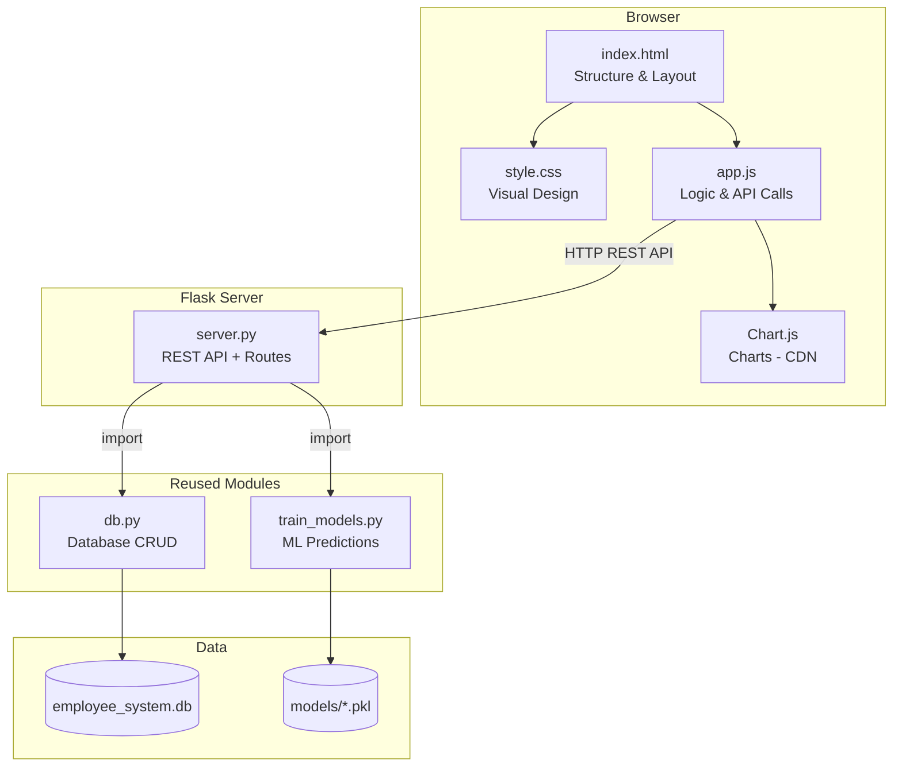

# 💼 Smart Employee Analytics — Tech Stack & File Structure

---

## 🛠️ Complete Technology Stack

### Backend (Server-Side)

| Technology | Purpose | Version |
|:---|:---|:---|
| **Python** | Core programming language | 3.10+ |
| **Flask** | Web framework / REST API server | 3.x |
| **Flask-CORS** | Cross-origin request handling | Latest |
| **PyJWT** | JWT token-based authentication | Latest |
| **SQLite** | Lightweight database (built-in Python) | Built-in |
| **mysql-connector-python** | MySQL support (optional fallback) | Latest |
| **Scikit-learn** | Machine Learning models (Salary, Promotion, Attrition) | Latest |
| **Pandas** | Data manipulation & analysis | Latest |
| **NumPy** | Numerical computations | Latest |
| **OpenPyXL** | Excel (.xlsx) export | Latest |
| **ReportLab** | PDF report generation | Latest |
| **Pickle** | ML model serialization | Built-in |

---

### Frontend (Client-Side)

| Technology | Purpose | Loaded Via |
|:---|:---|:---|
| **HTML5** | Page structure & semantic markup | Local file |
| **CSS3 (Vanilla)** | Styling, animations, responsive design | Local file |
| **JavaScript (ES6+)** | SPA logic, API calls, DOM manipulation | Local file |
| **Chart.js** | Interactive charts (pie, bar, scatter, radar, line) | CDN |
| **Google Fonts (Inter)** | Modern typography | CDN |
| **Font Awesome** | Icons throughout the UI | CDN |

---

### Design Features Used

| Feature | Description |
|:---|:---|
| **Glassmorphism** | Semi-transparent cards with backdrop blur |
| **Dark Theme** | Deep purple/indigo gradient background |
| **Micro-animations** | fadeUp, hover scale, glow effects, pulse |
| **Gradient Buttons** | Purple-to-violet gradient with hover glow |
| **Responsive Grid** | CSS Grid + Flexbox for all screen sizes |
| **Role Badges** | Color-coded badges (Admin=red, HR=blue, Employee=green) |

---

### Dev Tools & Utilities

| Tool | Purpose |
|:---|:---|
| **pip** | Python package manager |
| **Git** | Version control |
| **Browser DevTools** | Debugging & responsive testing |
| **VS Code** | Code editor (recommended) |

---

## 📁 Complete File Structure

```
python/
│
│── ── Existing Files (Untouched) ────────────────
│
├── 📄 app.py                        # Original Streamlit app (kept as-is)
├── 📄 db.py                         # Database module — REUSED by website
├── 📄 train_models.py               # ML training & predictions — REUSED by website
├── 📄 init_db.py                    # Standalone DB initializer
├── 📄 sql_database.sql              # MySQL schema (optional)
├── 📄 requirements.txt              # Python dependencies (updated)
├── 📄 README.md                     # Project documentation
├── 🖼️ hero.png                      # Dashboard hero image
├── 🗄️ employee_system.db            # SQLite database (auto-generated)
│
├── 📂 models/                       # Saved ML model files (auto-generated)
│   ├── salary_model.pkl
│   ├── promotion_model.pkl
│   ├── attrition_model.pkl
│   ├── le_edu.pkl
│   └── le_dept.pkl
│
│── ── New Website Files ─────────────────────────
│
├── 📂 website/                      # ⭐ NEW — Full-stack website
│   │
│   ├── 📄 server.py                 # Flask API backend (main entry point)
│   │                                  • All REST API endpoints
│   │                                  • JWT authentication middleware
│   │                                  • Imports db.py & train_models.py
│   │                                  • Serves static files & HTML
│   │
│   ├── 📂 templates/                # HTML templates (served by Flask)
│   │   └── 📄 index.html            # Single-page application (SPA)
│   │                                  • Login screen
│   │                                  • Sidebar navigation
│   │                                  • Dashboard section
│   │                                  • Employee directory section
│   │                                  • Add employee form
│   │                                  • Analytics section
│   │                                  • AI predictions section
│   │                                  • Export center section
│   │                                  • User management section
│   │
│   └── 📂 static/                   # Static assets
│       │
│       ├── 📂 css/
│       │   └── 📄 style.css         # Complete design system
│       │                              • CSS variables (colors, fonts, spacing)
│       │                              • Dark gradient background
│       │                              • Glassmorphism card styles
│       │                              • Animations (@keyframes)
│       │                              • Form input styling
│       │                              • Button gradients & effects
│       │                              • Responsive breakpoints
│       │                              • Table styling
│       │                              • Sidebar & navigation
│       │                              • Role badge colors
│       │                              • Chart containers
│       │
│       └── 📂 js/
│           └── 📄 app.js            # Frontend application logic
│                                      • API service layer (fetch calls)
│                                      • JWT auth (login/logout/token storage)
│                                      • SPA router (page switching)
│                                      • Dashboard renderer (KPIs + charts)
│                                      • Employee CRUD forms & table
│                                      • Analytics chart builders
│                                      • AI prediction form handlers
│                                      • Export download triggers
│                                      • User management (admin)
│                                      • Role-based UI visibility
│                                      • Form validation
```

---

## 🔗 How Files Connect



---

## 🚀 How to Run

```bash
# 1. Install dependencies
pip install flask flask-cors pyjwt

# 2. Start the website
cd website
python server.py

# 3. Open in browser
# → http://localhost:5000
```

---

## 📊 Total Files to Create

| Type | Count | Files |
|:---|:---:|:---|
| **Backend** | 1 | `server.py` |
| **HTML** | 1 | `index.html` |
| **CSS** | 1 | `style.css` |
| **JavaScript** | 1 | `app.js` |
| **Modified** | 1 | `requirements.txt` |
| **Total** | **5** | 4 new + 1 modified |
